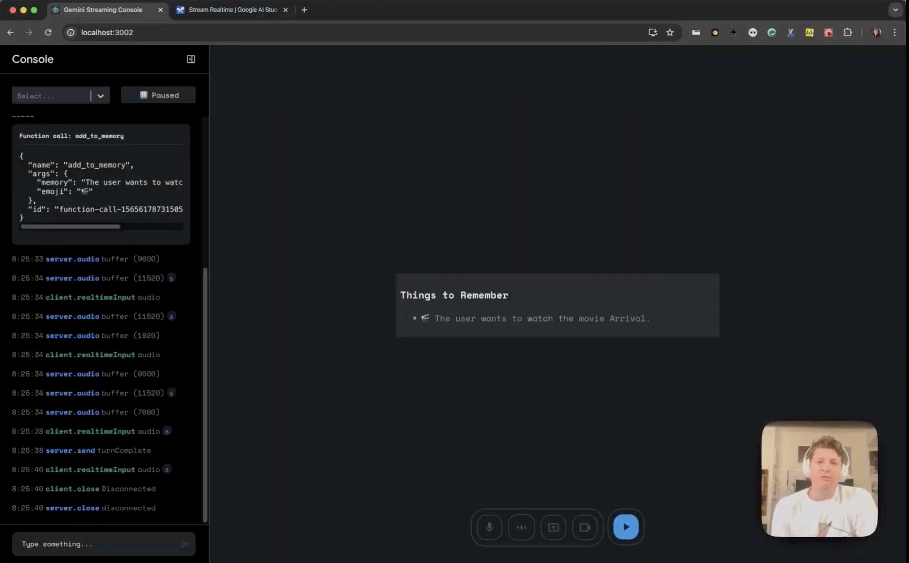

# MDC Shark Assistant 🦈

**AI-Powered Assignment Support for Neurodivergent Students**

[](https://www.mdc.edu)

---

## 🎓 About

**MDC Shark Assistant** is an innovative AI-powered educational tool designed specifically for neurodivergent students at Miami Dade College. Named after MDC's proud Shark mascot, this application provides intelligent, accessible assistance to help students complete their assignments with confidence and independence.

### Created By
**Professor Marquez**  
Miami Dade College

### Purpose
This application addresses the unique learning needs of neurodivergent students by providing:
- **Real-time AI assistance** for assignment completion
- **Multimodal interaction** (voice, text, and visual input)
- **Accessible interface** designed with cognitive ease in mind
- **Personalized support** that adapts to individual learning styles
- **Reduced anxiety** through calming, predictable design patterns

### Why "Shark Assistant"?
The name honors Miami Dade College's Shark mascot while embodying the qualities we want to instill in our students:
- **Confidence** - Navigate academic challenges with assurance
- **Determination** - Persist through difficult assignments
- **Adaptability** - Adjust to different learning situations
- **Strength** - Build academic resilience and capability

---

## 🌟 Key Features

### For Students
- ✅ **AI-Powered Help**: Get instant assistance with assignments using Google's Gemini AI
- ✅ **Voice Interaction**: Speak naturally to ask questions and get explanations
- ✅ **Visual Learning**: Share your screen or use webcam for visual problem-solving
- ✅ **Accessible Design**: High-contrast, neurodivergent-friendly interface
- ✅ **Focus Mode**: Distraction-reduced environment for deep work
- ✅ **Real-time Feedback**: Immediate responses to keep you on track

### Neurodivergent-Friendly Design
- 🧠 **WCAG AAA Compliant**: Maximum readability and contrast
- 🎨 **Calming Color Palette**: MDC Blue and Orange reduce anxiety
- 📐 **Consistent Patterns**: Predictable layouts reduce cognitive load
- 🎯 **Clear Visual Hierarchy**: Easy to understand information structure
- ⚡ **Reduced Motion**: Gentle animations prevent overstimulation
- 🔍 **High Contrast**: Easy-to-read text for all vision types

---

## 🎨 Design Philosophy

Every design decision in MDC Shark Assistant was made with neurodivergent learners in mind:

### Color Psychology
- **MDC Blue (#0066CC)**: Promotes trust, focus, and calmness
- **MDC Orange (#FF6600)**: Encourages engagement without stress
- **Success Green**: Positive reinforcement without overwhelm
- **Focus Purple**: Supports concentration and deep work

### Accessibility First
- High contrast ratios (11.5:1 for text)
- Consistent color meanings throughout
- Clear focus indicators for keyboard navigation
- Screen reader compatible
- Reduced visual noise and clutter

For detailed design documentation, see [DESIGN_SYSTEM.md](./DESIGN_SYSTEM.md) and [COLOR_PALETTE.md](./COLOR_PALETTE.md).

---

## 🚀 Getting Started

### Prerequisites
- Node.js 16 or higher
- A Google Gemini API key ([Get one free here](https://aistudio.google.com/apikey))
- Modern web browser (Chrome, Firefox, Safari, or Edge)

### Installation

1. **Clone the repository**
   ```bash
   git clone [repository-url]
   cd mdc-shark-assistant
   ```

2. **Install dependencies**
   ```bash
   npm install
   ```

3. **Set up your API key**
   - Create a `.env` file in the root directory
   - Add your Gemini API key:
     ```
     REACT_APP_GEMINI_API_KEY=your_api_key_here
     ```

4. **Start the application**
   ```bash
   npm start
   ```

5. **Open in browser**
   - Navigate to [http://localhost:3000](http://localhost:3000)
   - Start using MDC Shark Assistant!

---

## 💡 How to Use

### For Students

1. **Connect**: Click the blue connect button to start your session
2. **Ask Questions**: 
   - Type your question in the text input
   - Or click the microphone to speak naturally
3. **Share Your Work**: 
   - Use screen share to show your assignment
   - Use webcam for visual problem-solving
4. **Get Help**: The AI will provide explanations, guidance, and support
5. **Stay Focused**: Use the focus mode for distraction-free learning

### For Educators

This tool is designed to:
- Supplement classroom instruction
- Provide 24/7 homework support
- Reduce student anxiety around assignments
- Build student confidence and independence
- Track engagement (future feature)

---

## 🏫 Miami Dade College Integration

MDC Shark Assistant proudly represents Miami Dade College's commitment to inclusive education and student success.

### MDC Values Reflected
- **Access**: Available to all students, designed for diverse needs
- **Excellence**: Powered by cutting-edge AI technology
- **Innovation**: Forward-thinking approach to education
- **Student Success**: Focused on helping students achieve their goals
- **Diversity**: Celebrates and supports neurodiversity

### Shark Pride 🦈
Just like MDC's Shark mascot, this assistant embodies:
- Strength in academics
- Adaptability in learning
- Confidence in achievement
- Determination to succeed

---

## 🛠️ Technical Details

### Built With
- **React** - Modern UI framework
- **TypeScript** - Type-safe development
- **Google Gemini AI** - Advanced language model
- **Web Audio API** - Real-time audio processing
- **WebRTC** - Screen and webcam capture
- **SCSS** - Professional styling system

### Architecture
MDC Shark Assistant uses Google's Gemini Live API over WebSocket for real-time, multimodal AI interaction. The application provides:
- Event-driven WebSocket client for seamless communication
- Audio processing layer for voice input/output
- Video capture capabilities for visual learning
- Unified logging for development and debugging

### Code Example

Below is an example showing how the application uses Google Search grounding and renders visualizations using [vega-embed](https://github.com/vega/vega-embed):

```typescript
import { type FunctionDeclaration, SchemaType } from "@google/generative-ai";
import { useEffect, useRef, useState, memo } from "react";
import vegaEmbed from "vega-embed";
import { useLiveAPIContext } from "../../contexts/LiveAPIContext";

export const declaration: FunctionDeclaration = {
  name: "render_altair",
  description: "Displays an altair graph in json format.",
  parameters: {
    type: SchemaType.OBJECT,
    properties: {
      json_graph: {
        type: SchemaType.STRING,
        description:
          "JSON STRING representation of the graph to render. Must be a string, not a json object",
      },
    },
    required: ["json_graph"],
  },
};

export function Altair() {
  const [jsonString, setJSONString] = useState<string>("");
  const { client, setConfig } = useLiveAPIContext();

  useEffect(() => {
    setConfig({
      model: "models/gemini-2.0-flash-exp",
      systemInstruction: {
        parts: [
          {
            text: 'You are my helpful assistant. Any time I ask you for a graph call the "render_altair" function I have provided you. Dont ask for additional information just make your best judgement.',
          },
        ],
      },
      tools: [{ googleSearch: {} }, { functionDeclarations: [declaration] }],
    });
  }, [setConfig]);

  useEffect(() => {
    const onToolCall = (toolCall: ToolCall) => {
      console.log(`got toolcall`, toolCall);
      const fc = toolCall.functionCalls.find(
        (fc) => fc.name === declaration.name
      );
      if (fc) {
        const str = (fc.args as any).json_graph;
        setJSONString(str);
      }
    };
    client.on("toolcall", onToolCall);
    return () => {
      client.off("toolcall", onToolCall);
    };
  }, [client]);

  const embedRef = useRef<HTMLDivElement>(null);

  useEffect(() => {
    if (embedRef.current && jsonString) {
      vegaEmbed(embedRef.current, JSON.parse(jsonString));
    }
  }, [embedRef, jsonString]);
  return <div className="vega-embed" ref={embedRef} />;
}
```

---

## 👨‍💻 Development

### Project Structure
```
mdc-shark-assistant/
├── src/
│   ├── components/       # React components
│   │   ├── header/       # MDC branding and attribution
│   │   ├── control-tray/ # Main control buttons
│   │   ├── side-panel/   # Settings and navigation
│   │   ├── logger/       # Activity logging
│   │   └── ...
│   ├── contexts/         # React contexts (LiveAPI)
│   ├── hooks/            # Custom React hooks
│   ├── lib/              # Utilities and helpers
│   └── App.scss          # Global styles and color system
├── public/               # Static assets
└── DESIGN_SYSTEM.md      # Design documentation
```

### Available Scripts

#### `npm start`
Runs the app in development mode at [http://localhost:3000](http://localhost:3000).  
The page will hot-reload when you make edits.

#### `npm test`
Launches the test runner in interactive watch mode.

#### `npm run build`
Builds the app for production to the `build` folder.  
Optimizes the build for best performance with minification and hashing.

#### `npm run lint`
Checks code quality and style consistency.

### Development Notes
This project was bootstrapped with [Create React App](https://github.com/facebook/create-react-app) and enhanced with:
- Event-emitting WebSocket client for real-time communication
- Audio processing layer for voice interaction
- Video capture capabilities for visual learning
- Comprehensive logging system for debugging
- Accessible, neurodivergent-friendly UI components

---

## 📚 Documentation

- **[README.md](./README.md)** - This file (overview and getting started)
- **[DESIGN_SYSTEM.md](./DESIGN_SYSTEM.md)** - Complete design rationale and guidelines
- **[COLOR_PALETTE.md](./COLOR_PALETTE.md)** - Color system reference
- **[README_MDC.md](./README_MDC.md)** - Additional MDC-specific documentation
- **[CONTRIBUTING.md](./CONTRIBUTING.md)** - How to contribute (if applicable)

---

## 🤝 Contributing

MDC Shark Assistant is an educational project created for Miami Dade College students. We welcome contributions that:
- Improve accessibility for neurodivergent learners
- Enhance the user experience
- Fix bugs or improve performance
- Add helpful documentation

Please ensure all contributions maintain:
- WCAG AAA accessibility standards
- Consistent design system usage
- Clear, commented code
- Respect for neurodivergent-friendly principles

---

## 🎯 Future Enhancements

### Planned Features
- [ ] Dark mode for low-light studying
- [ ] Progress tracking dashboard for students
- [ ] Integration with MDC Canvas LMS
- [ ] Offline mode for limited connectivity
- [ ] Multiple language support
- [ ] Customizable interface themes (within accessible ranges)
- [ ] Study group collaboration features
- [ ] Assignment deadline reminders

### Research Goals
- Conduct user studies with MDC students
- Measure impact on assignment completion rates
- Gather feedback from MDC Disability Services
- Iterate based on real-world usage data
- Publish findings to benefit other institutions

---

## 📄 License & Credits

### Created By
**Professor Marquez**  
Miami Dade College  
Educational Technology Innovation

### Purpose
This application was created to support neurodivergent students at Miami Dade College in achieving academic success through accessible, AI-powered assistance.

### Acknowledgments
- **Miami Dade College** - For supporting innovative educational technology
- **MDC Students** - For inspiring this accessible design
- **MDC Disability Services** - For guidance on accessibility best practices
- **Google Gemini** - For providing the AI technology
- **Open Source Community** - For the tools and frameworks used

### License
Educational Use - Miami Dade College  
This project is intended for educational purposes at Miami Dade College.

### Google Gemini Live API
This application uses Google's Gemini Live API. This is an educational implementation showcasing the Live API capabilities. Please respect copyright and trademark rights when sharing or creating derivative works.

For more information: [Google's Site Policies](https://developers.google.com/terms/site-policies)

---

## 📞 Support & Contact

### For Students
- Visit your campus Disability Services office
- Contact your instructor or academic advisor
- Check MDC's student support resources

### For Educators & Administrators
- **Creator**: Professor Marquez
- **Institution**: Miami Dade College
- **Purpose**: Improving student success through accessible technology

### Report Issues
If you encounter bugs or have suggestions:
1. Document the issue clearly
2. Include steps to reproduce
3. Note your browser and operating system
4. Submit through appropriate MDC channels

---

## 🦈 Go Sharks!

MDC Shark Assistant embodies the spirit of Miami Dade College:
- **Excellence** in education
- **Innovation** in technology
- **Inclusion** for all learners
- **Success** for every student

Together, we're making education more accessible, one assignment at a time.

---

**Version**: 1.0  
**Last Updated**: October 2024  
**Status**: Active Development  
**Built with ❤️ for MDC Students**
